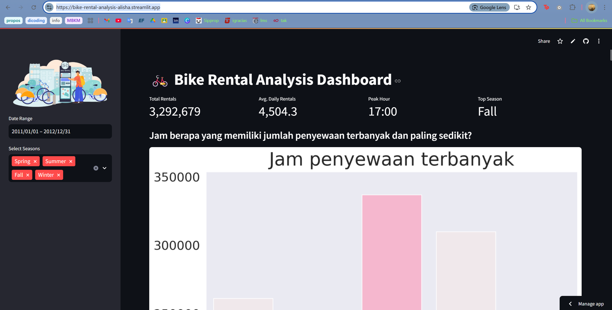

# Analysis-Bike-Rental
## Preview 


## Proyek Analisis Data
Repository ini berisi proyek analisis data yang saya kerjakan sebagai bagian dari submission Belajar Analisis Data dengan Python. Proyek ini menggunakan Streamlit untuk membuat dashboard interaktif berdasarkan Bike Sharing Dataset.

## Deskripsi
Proyek ini bertujuan untuk menganalisis data dari Bike Sharing Dataset dan menyajikan wawasan yang berguna melalui dashboard interaktif. Dengan menganalisis pola penggunaan sepeda, kita dapat memahami faktor-faktor yang memengaruhi jumlah penyewaan sepeda.

## Struktur Direktori

Analysis-Bike-Rental/
- **/dashboard**: Direktori ini berisi dashboard.py yang digunakan untuk membuat dashboard hasil analisis data
- **/data**: Direktori ini berisi data yang digunakan dalam proyek, dalam format.csv
- **/notebook.ipynb**: Notebook Jupyter untuk eksplorasi dan analisis data

## Instalasi
1. Clone repository ini ke komputer lokal Anda menggunakan perintah berikut:
   ```bash
   git clone https://github.com/alishaanggranidi/Analysis-Bike-Rental.git
   ```
2. Masuk ke direktori proyek:
   ```bash
   cd <folder local>
   ```
3. Install dependencies yang diperlukan:
   ```bash
   pip install streamlit
   pip install -r requirements.txt
   ```
4. run the dashboard 
   ```cd dashboard 
   streamlit run dashboard.py
   ```   
## Website
    Atau bisa dengan kunjungi website ini [Project Data Analytics](https://bike-rental-analysis-alisha.streamlit.app/)
